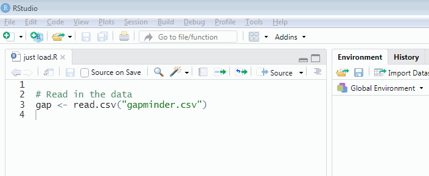

# Starting R

This tutorial is a tour of some of the basics of the R language. Please follow along in RStudio as you read and try not to peek at the answers until you have given the activities a good go!

By the end of this tutorial you will know how to:

* Do basic stuff in R like arithmetic
* Assign results of calculations to variables and refer to these
* Calculate descriptive statistics like mean and standard deviation (SD)
* Install add-on packages from the internet and include them
* Open a dataset in R

This will prepare you for your first analysis of data.


## Arithmetic {.tabset}

You can use R as a calculator:

`+` is addition

`-` is subtraction

`*` is multiplication

`/` is division

`^` is exponentiation


So, for instance to calculate $\frac{1}{2}$ you do

```{r eval=FALSE}
1/2
```

To work out $2^3$ do:

```{r eval=FALSE}
2^3
```

The usual mathematical order of precedence rules apply, so

```{r eval=FALSE}
1 + 2 * 3
```

gives different result to

```{r eval=FALSE}
(1 + 2) * 3
```
(Try it!)


### Activities

Easing in tremendously gently...

(a) What is the R code to calculate 2 + 2

(b) How do you multiply 6 and 7?


### Answers

(a) What is the R code to calculate 2 + 2

```{r}
2 + 2
```

(b) How do you multiply 6 and 7?

```{r}
6 * 7
```


## Variables {.tabset}

R has a flexible way of creating and naming "objects" of various kinds, so that you can refer to them later. These objects may be things like the answer to a sum, a whole dataset, or the result of a regression analysis.

Let's start with a sum -- we will get to the more complex examples soon!

Look at this R code:

```{r}
first_bit  <- 2 + 2
second_bit <- first_bit / 8
```

Read as

* "set `first_bit` to 2 plus 2"
* "set `second_bit` to `first_bit` divided by 8"

The "<-" symbol is called an "assignment statement" and `first_bit` and `second_bit` are variable names.


### Activity

When you run the code above, you will see that nothing actually seems to happen. Can you guess what you need to do to get the answer to the `second_bit` sum?

### Answer

You just have to type and run the name of the variable.

```{r}
second_bit
```


## A note on variable names

There are limitations to the names you can use for variables (but ways to get around those -- for another time). To keep life simple:

* make sure variable names always start with a character, "a" to "z".
* they can have a number after the first character
* you can use an underscore, "_", as a sort of space
* remember that variables are cAsE sEnSiTiVe and consider always using lower case
* try to make variable names meaningful


## Vectors {.tabset}

Vectors are a list of values of the same type of information. They usually come from a dataset, but you can also build them directly in R.

Vectors can be of whole numbers...

```{r eval = F}
c(3,1,4,1,3,1,1,3,2,1)
```

... or (approximations of) real numbers...

```{r eval = F}
c(1.2, 2.4, -2.3)
```

... or character strings, which are often used to represent categorical information:

```{r}
gender <- c("woman", "woman", "man", "woman",
            "genderqueer", "genderqueer", "gender fluid")
```

In this last example, I have saved the vector in a variable called `gender`.


### Activity

Try making a vector of the members of your favourite band (or other grouping of people that makes sense to you) and save the result in a variable with a meaningful name.

### Answer

```{r}
stereo_total <- c("Françoise Cactus", "Brezel Göring")
```


## Functions {.tabset}

A function in R is a magical computational machine which takes an input and transforms it in some way, giving an output. (This is not a formal definition.)

Here's a vector:

```{r eval = FALSE}
c(2,4,12)
```

One of R's functions calculates the mean of a vector of numbers:

```{r}
mean(c(2,4,12))
```
There is another for the median:

```{r}
median(c(2,4,12))
```

Since these are built into R, there is also help. Try typing:

```{r eval = F}
?mean
```

We can also apply functions to variables. Another useful function is `table` which creates a table of counts.

So, in summary, to use a function you use its name and then tell it the inputs in parentheses.


### Activity

Make a table of the `gender` variable we created earlier.

### Answer

```{r}
table(gender)
```

Note how this gives the same result as:

```{r}
table(c("woman", "woman", "man", "woman",
            "genderqueer", "genderqueer", "gender fluid"))
```
But without having to copy and paste the vector.


## More functions {.tabset}

Functions can have zero inputs. Try `citation` which tells you how to cite R in write ups.

```{r eval = F}
citation()
```

(You could also try without the parentheses -- not something you'd generally want to do on purpose -- to see what happens.)

Functions can have more than one input. Another handy function, called `rnorm`, generates random data from a normal distribution, with a given number of values, mean, and SD.

Here is an example with 50 values with a mean of 20 and an SD of 5:

```{r}
random_values <- rnorm(50, 20, 5)
random_values
```

When you run it you will probably get different numbers to me.

Here is a histogram of values I got:

```{r}
hist(random_values)
```


### Activity

Try calculating the mean and standard deviation (the command is called `sd`) of the data you generated. What do you notice?

### Answer

Here's what I got:

```{r}
mean(random_values)
sd(random_values)
```

Unless you were very lucky, you probably discovered like me that the mean was different to 20 and the SD was different to 5. This is something we will return to in another session, but can you guess now why this has happened?


## Data frames {.tabset}

Data frames [are](http://search.r-project.org/R/library/base/html/data.frame.html) "tightly coupled collections of variables... used as the fundamental data structure by most of R's modeling software."

In practice, data frames are usually read in from files (next section); however, it can be helpful to see how to make them "by hand" within R.

To make them, use the function `data.frame` with named vectors comprising the data.

Here is an example, created with [copy and paste from Wikipedia](https://en.wikipedia.org/wiki/Stereo_Total). I have used newlines and space to make it readable.

```{r}
stereo_total_albums <- data.frame(year = c(1995,
                                           1997,
                                           1998,
                                           1999,
                                           2001,
                                           2002,
                                           2005,
                                           2007,
                                           2009,
                                           2010,
                                           2011,
                                           2012,
                                           2015,
                                           2016,
                                           2019),
                                  album = c("Oh Ah!",
                                            "Monokini",
                                            "Juke-Box Alarm",
                                            "My Melody",
                                            "Musique Automatique",
                                            "Trésors cachés",
                                            "Do the Bambi",
                                            "Paris-Berlin",
                                            "No Controles",
                                            "Baby ouh!",
                                            "Underwater Love",
                                            "Cactus versus Brezel",
                                            "Yéyé Existentialiste",
                                            "Les hormones",
                                            "Ah! Quel Cinéma!"))
```

Do not build data frames like this with real data as it is painfully dull. However, it did get the data into R. R will print this in a sensible way if you run the data frame's name:

```{r}
stereo_total_albums
```


A few things you might want to do with data frames include:

Listing the variables:

```{r}
names(stereo_total_albums)
```
Finding out how many rows it has:

```{r}
nrow(stereo_total_albums)
```

You will often want to refer to a vector within the data frame, which you do with the $ operator:

```{r}
stereo_total_albums$year
```

This is just like any other vector, so you could draw a histogram of the years of album releases:

```{r}
hist(stereo_total_albums$year,
     xlab = "Year",
     main = "Stereo Total albums")
```

`hist` has automatically chosen to group years in fives based on how much data there was and how it's distributed. Note also how I changed the default settings on x-axis label and title.
 

### Activity

What's the median of the years albums were released?

### Answer

```{r}
median(stereo_total_albums$year)
```


## Loading data frames from a file {.tabset}

It is easy to read files into R. This command loads an excerpt from the [Gapminder dataset](https://github.com/jennybc/gapminder) (extracted and tidied by Jennifer Bryan), which you can find [here](./gapminder.csv). Save the file in the same folder as your R or Rmd file and run:

```{r}
gap <- read.csv("gapminder.csv")
```

Here "csv" stands for "comma separated values". If you open the file in, say, Notepad, then you will see why.

If it worked, then this command will show the top 5 rows:

```{r}
head(gap,5)
```

If it *didn't* work, then you're probably not using R markdown. You can try changing the working directory to the same place as your R "source file".



The variables in the dataset are as follows:

* **country:** The country

* **continent:** The continent

* **year:** ranges from 1952 to 2007 in increments of 5 years

* **lifeExp:** life expectancy at birth, in years

* **pop:** population

* **gdpPercap:** GDP per capita (US$, inflation-adjusted)


We can plot life expectancy against the GDP per capita as follows:

```{r}
plot(lifeExp ~ gdpPercap, data = gap)
```

The "~" is read as "tilde" (or sometimes "twiddle"). The x-axis labels may not be readable at first but we shall return to this in a later session. (If you can't wait, [try this](https://en.wikipedia.org/wiki/Scientific_notation#E_notation.)


### Activity

Plot life expectancy at birth against year.

### Answer

```{r}
plot(lifeExp ~ year,
     data = gap,
     xlab = "Year",
     ylab = "Life expectancy at birth")
```

Again I have changed the axis label defaults.


## Packages  {.tabset}

When you install R, it comes with a small collection of essential packages which consist of functions like `mean`, `sd`, and `hist` that we have used above. But a strength of R is that there are a HUGE number of packages written by people across the world who use R and these can easily be downloaded from the interweb and added using R. These add-ons do things like produce pretty data visualisations (e.g., used by the [BBC Data and Visualisation Journalism team](http://www.interhacktives.com/2020/03/09/how-to-create-bbc-style-graphics-with-r-a-bbplot-tutorial/)) and statistical models required by social scientists. The core [recommended text](https://socialsciences.mcmaster.ca/jfox/Books/Companion/) also has [an R package](https://cran.r-project.org/web/packages/car/index.html).

Here is an example, using the *praise* package. To download and install the package, use this command:

```{r eval = F}
install.packages("praise")
```

If this has worked, you will have seen text something like:

```
trying URL 'https://cran.rstudio.com/bin/windows/contrib/4.0/praise_1.0.0.zip'
Content type 'application/zip' length 19729 bytes (19 KB)
downloaded 19 KB

package ‘praise’ successfully unpacked and MD5 sums checked
```

Now the package is on your local computer but it isn't available to use yet. You also have to do:

```{r}
library(praise)
```

(Note how there were no quotation marks here.)

If *this* worked, then... well not much will have happened. But R won't have complained.


### Activity

The *praise* packages provides a function also called *praise*, which requires no input to run. Give it a go -- what happens?

### Answer

I'll run it a few times...

```{r}
praise()
praise()
praise()
```

Not a big data science algorithm, but you may find it helpful as the course progresses :)


## The end!

```{r}
praise()
```


