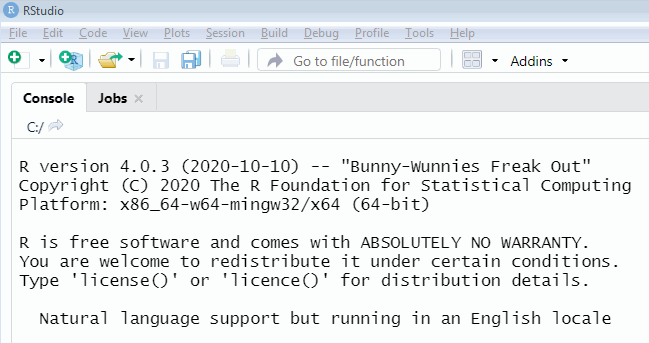
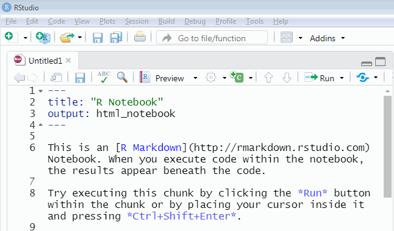
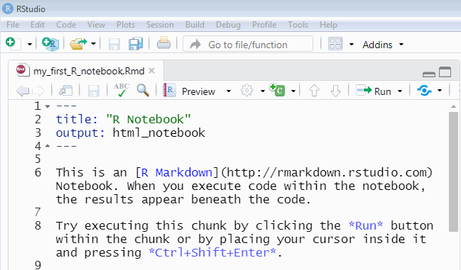
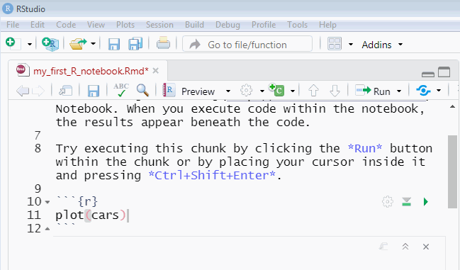

# Starting RStudio

This is an attempt to explain how to get going super-fast, mostly by using animated GIFs. For something more substantial, try Healy's intro [over here](https://socviz.co/gettingstarted.html).

## Download, install, and run

First ensure that you have installed both [RStudio](https://rstudio.com/) and [R](https://cran.r-project.org/). RStudio is a friendly user interface which makes it easier to run analyses. R is the software which does the number crunching.

Once both are installed, run RStudio.

## Make a new R Notebook file

## Read the clues it provides

Here they are:

>This is an [R Markdown](http://rmarkdown.rstudio.com) Notebook. When you execute code within the notebook, the results appear beneath the code. 
>
>Try executing this chunk by clicking the *Run* button within the chunk or by placing your cursor inside it and pressing *Ctrl+Shift+Enter*. 

In a couple of steps' time, you are going to try this.

## Save the file

## Run the example R command

Now try what the clue suggested:

## Clear it and try a sum

This step involves adding a "chunk" which is where R code goes -- see the GIF below for how to do this...

## Did that help?

If so, try the next chapter! Otherwise, I can again recommend [Healy's intro](https://socviz.co/gettingstarted.html).
